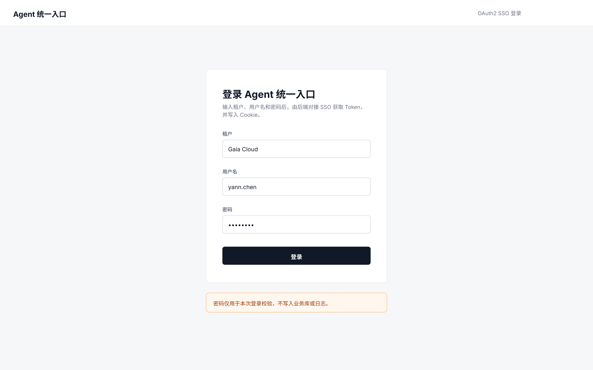
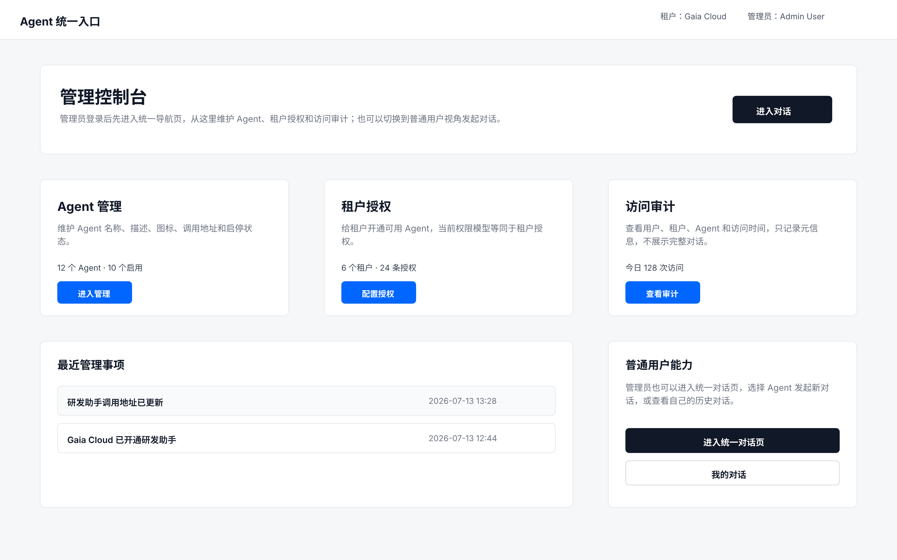
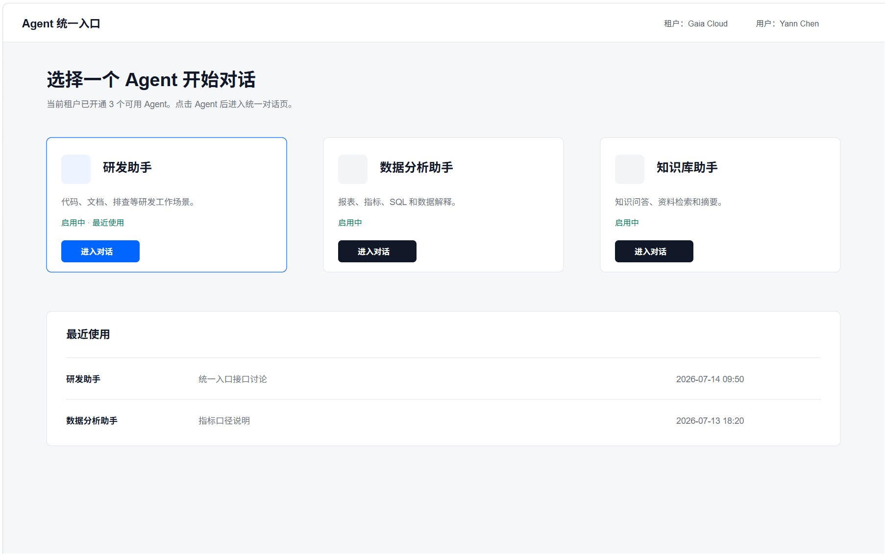
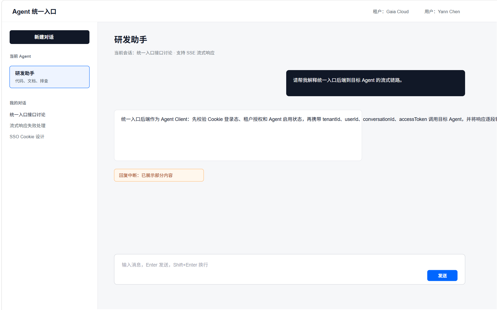
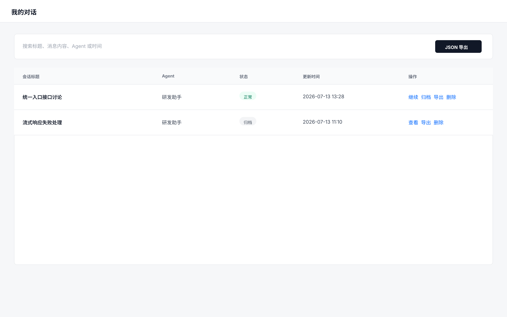
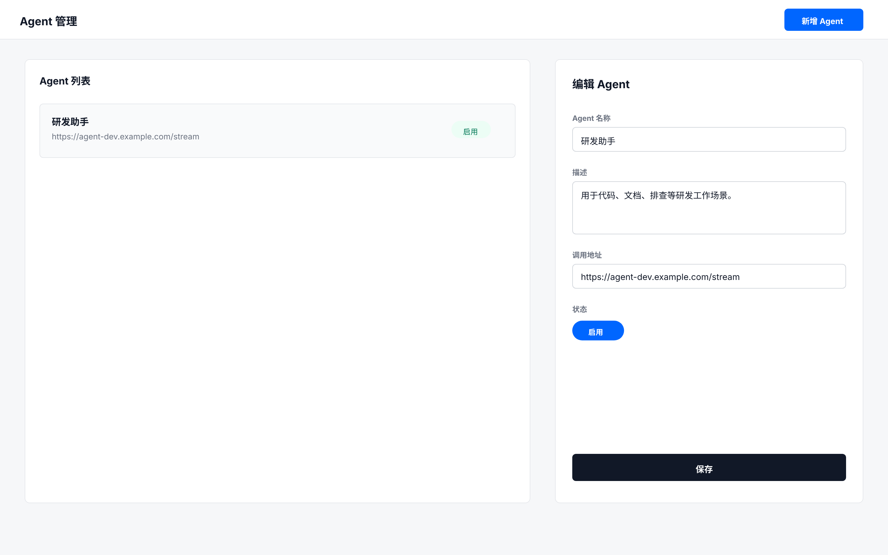
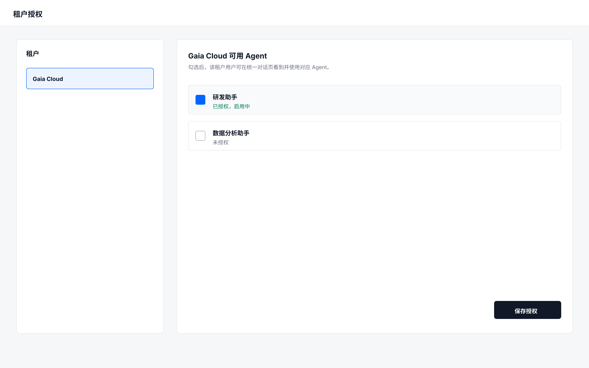
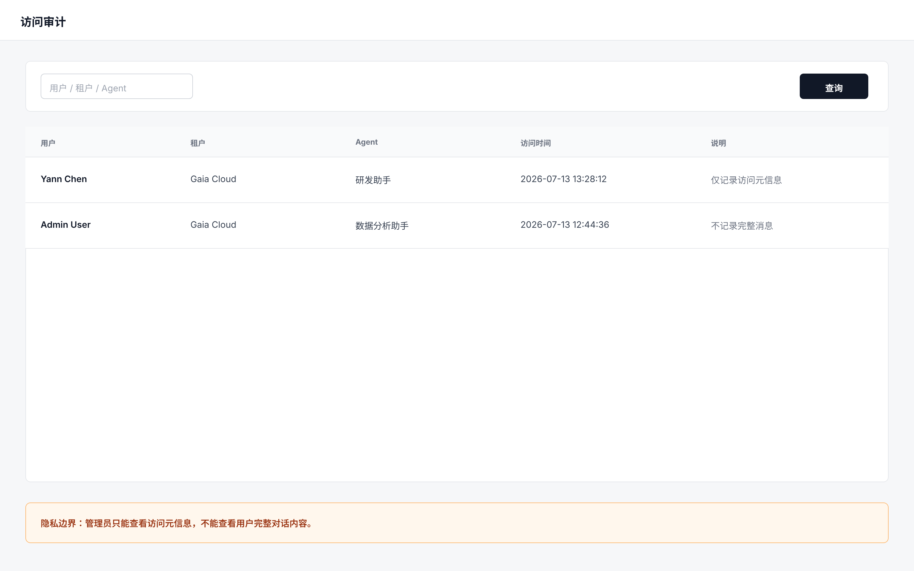

# Agent统一入口Web版

> **文档说明**：本文档面向产品、设计、前后端开发、测试等所有团队成员。所有信息集中在一起，不同角色可以从中提取各自需要的信息。
>
> **重要提醒**：本文档描述 Web 版 Agent 统一入口需求。本系统只负责统一登录、Agent 选择、对话代理、会话管理、Agent 配置、租户授权与访问审计，不实现具体 Agent 能力。

## 📋 文档信息

| 项目 | 内容 |
|------|------|
| 需求名称 | Agent统一入口Web版 |
| 文档状态 | 已确认 |
| 创建日期 | 2026-07-13 |
| 最后更新 | 2026-07-13 |
| 负责人 | 待确认 |
| 优先级 | 待确认 |

---

## 一、需求概述

### 1.1 背景

公司内部可能存在多个 Agent 能力，不同 Agent 的入口、调用地址、接入方式和会话管理方式不统一。用户如果需要使用不同 Agent，需要分别寻找入口或理解不同系统的使用方式，使用成本较高。

本需求建设一个 Web 版 Agent 统一入口。普通用户通过现有 OAuth2 SSO 登录后，先进入 Agent 选择页，查看当前租户可用 Agent 数量与 Agent 列表，点击某个 Agent 后进入统一对话页；统一对话页左侧只展示新建对话和该 Agent 下的历史对话。管理员登录后进入管理员导航页，通过统一导航进入 Agent 管理、租户授权、访问审计等管理页面，也可以切换到普通用户能力进入 Agent 选择页。系统后端作为统一 Agent 客户端或代理层，将页面请求转发给真实 Agent 服务，并将 Agent 的流式响应转发回页面。系统不实现具体 Agent 能力，只负责统一入口、租户级授权、对话保存、Agent 基础配置和访问审计。

---

### 1.2 目标

1. 提供统一入口登录能力，用户输入租户、用户名和密码后，由后端对接 OAuth2 SSO 获取 Token，并通过响应 Cookie 维持登录态。
2. 提供 Agent 选择页，使普通用户登录后先查看当前租户可用 Agent，并在选择某个 Agent 后进入统一对话页。
3. 支持前端到统一入口后端、统一入口后端到目标 Agent 的全链路流式响应。
4. 支持多租户下的租户级 Agent 授权，租户开通后该租户用户可见并可使用对应 Agent。
5. 支持用户管理自己的完整对话，包括查看、归档、检索、JSON 导出和物理删除。
6. 支持管理员维护 Agent 基础配置、启停状态和租户授权。
7. 支持访问审计，仅记录用户访问 Agent 的元信息，不在审计日志中记录完整消息内容。

---

### 1.3 适用范围

- 目标用户：普通用户、管理员。
- 使用场景：普通用户登录后先在 Agent 选择页选择 Agent，再进入统一对话页发起对话；管理员登录后进入管理员导航页，维护 Agent 配置、租户授权和访问审计，也可进入 Agent 选择页使用普通用户能力。
- 适用环境：公司内部多租户环境，接入现有 OAuth2 SSO。
- 系统边界：本系统不实现具体 Agent 的业务能力、模型推理、Prompt 编排、工具链或业务执行逻辑。

---

## 二、功能说明

### 2.1 功能描述

本系统提供一个 Web 版 Agent 统一入口。普通用户登录后进入 Agent 选择页，选择某个 Agent 后进入统一对话页发起对话；管理员登录后进入管理员导航页，通过导航卡片进入 Agent 管理、租户授权、访问审计，也可以进入 Agent 选择页或我的对话。前端将用户消息发送给统一入口后端，后端根据 `agentId` 查询 Agent 配置和租户授权，作为客户端调用目标 Agent 服务，并将目标 Agent 的流式响应转发给前端。

核心功能范围：

- OAuth2 SSO 登录与登录态校验：用户在统一入口登录页输入租户、用户名、密码，统一入口后端调用 SSO 获取 Token，并通过响应 Cookie 写入浏览器。
- 用户名展示，支持展示租户名。
- Agent 选择页与统一对话页。
- 全链路流式对话：页面到统一入口后端，统一入口后端到目标 Agent。
- 用户个人对话管理：查看、归档、检索、JSON 导出、物理删除。
- Agent 基础管理：名称、描述、图标、调用地址、启用/停用状态。
- 租户级 Agent 授权。
- 访问审计：记录谁在什么时间访问了哪个 Agent。

明确不做：

- 不实现具体 Agent。
- 不实现 Agent 内部 Prompt、工具链、模型推理和业务执行逻辑。
- 不支持管理员查看用户完整对话内容。
- 不在审计日志中记录完整消息内容。
- 本期不做租户内用户级或角色级 Agent 授权。
- 本期不考虑复杂超时、限流和错误码策略。

---

### 2.2 页面结构

#### 2.2.1 系统整体导航

| 菜单/页面 | 页面用途 | 适用角色 | 是否本期必做 | 说明 |
|-----------|----------|----------|--------------|------|
| 管理员导航页 | 管理员登录后的统一导航和管理入口 | 管理员 | 是 | 管理员默认首页，可进入 Agent 管理、租户授权、访问审计、统一对话页和我的对话 |
| Agent 选择页 | 展示当前租户可用 Agent，选择后进入对话 | 普通用户、管理员 | 是 | 普通用户登录后的默认页面；管理员可从导航页进入 |
| 统一对话页 | 基于已选择 Agent 进行对话 | 普通用户、管理员 | 是 | 从 Agent 选择页点击某个 Agent 后进入；左侧只展示新建对话和该 Agent 历史对话 |
| 我的对话 | 管理个人历史对话 | 普通用户、管理员 | 是 | 可作为统一对话页的侧栏或独立视图 |
| Agent 管理 | 管理 Agent 基础配置 | 管理员 | 是 | 可作为后台入口或管理视图 |
| 租户授权 | 配置租户可使用的 Agent | 管理员 | 是 | 权限当前等同于租户授权 |
| 访问审计 | 查看 Agent 访问记录 | 管理员 | 是 | 不展示完整消息内容 |
| 登录页 | 输入租户、用户名、密码并完成登录 | 普通用户、管理员 | 是 | 页面采集登录信息，后端对接 OAuth2 SSO 获取 Token 并设置 Cookie |
| SSO 登录/回调 | OAuth2 Token 获取与登录态处理 | 普通用户、管理员 | 是 | 由统一入口后端与 SSO 交互，通常不作为业务菜单展示 |

#### 2.2.2 页面规格

##### 页面：登录页

**页面用途**：
- 用户输入租户、用户名和密码，完成 Agent 统一入口平台登录。

**适用角色**：
- 普通用户
- 管理员

**页面模块**：
- 登录表单区：租户、用户名、密码。
- 登录反馈区：展示登录失败、租户不存在、账号密码错误等提示。
- 登录态处理：登录成功后由后端响应设置 Cookie，前端跳转统一对话页。

**字段清单**：

| 字段名 | 字段类型 | 是否必填 | 枚举值/范围 | 默认值 | 显示条件 | 校验规则 | 说明 |
|--------|----------|----------|-------------|--------|----------|----------|------|
| 租户 | 输入框/下拉 | 是 | 系统租户 | 无 | 未登录访问时 | 不能为空 | 用于确定用户所属租户和后续 Agent 授权范围 |
| 用户名 | 输入框 | 是 | SSO 用户 | 无 | 未登录访问时 | 不能为空 | 由后端传递给 SSO 校验 |
| 密码 | 密码框 | 是 | SSO 凭据 | 无 | 未登录访问时 | 不能为空 | 前端不得明文持久化，后端不得记录日志 |

**按钮/操作清单**：

| 按钮/操作 | 可见条件（状态×角色） | 可点击条件 | 点击后动作 | 目标状态 | 成功反馈 | 失败反馈 |
|-----------|------------------------|------------|------------|----------|----------|----------|
| 登录 | 未登录 × 普通用户/管理员 | 租户、用户名、密码均已填写 | 前端提交登录请求到统一入口后端，后端调用 OAuth2 SSO 获取 Token，并通过响应 Cookie 写入浏览器 | 已登录 | 普通用户跳转 Agent 选择页；管理员跳转管理员导航页 | 登录失败时展示具体错误提示 |

**跳转关系**：

| 触发位置 | 触发动作 | 目标页面/弹窗 | 携带参数 | 状态变化 |
|----------|----------|---------------|----------|----------|
| 登录页 | 普通用户登录成功 | Agent 选择页 | Cookie 中的登录态 | 未登录变为已登录 |
| 登录页 | 管理员登录成功 | 管理员导航页 | Cookie 中的登录态 | 未登录变为已登录 |
| 任意受保护页面 | Cookie 无效或过期 | 登录页 | 原访问地址可作为回跳参数 | 已登录变为未登录 |

**原型图**：
- 

---

##### 页面：管理员导航页

**页面用途**：
- 管理员登录后的默认首页，集中展示管理入口和普通用户能力入口。

**适用角色**：
- 管理员

**页面模块**：
- 顶部用户信息区：展示租户名、管理员用户名。
- 管理入口区：Agent 管理、租户授权、访问审计。
- 最近管理事项：展示近期管理操作摘要。
- 普通用户能力入口：进入 Agent 选择页、我的对话。

**字段清单**：

| 字段名 | 字段类型 | 是否必填 | 枚举值/范围 | 默认值 | 显示条件 | 校验规则 | 说明 |
|--------|----------|----------|-------------|--------|----------|----------|------|
| 管理员用户名 | 只读展示 | 是 | SSO 返回值 | 无 | 管理员登录后 | 不允许为空 | 用于标识当前管理员 |
| 租户名 | 只读展示 | 条件必填 | SSO 或租户服务返回值 | 无 | 多租户场景 | 有租户信息时展示 | 用于提示当前租户上下文 |
| Agent 管理入口 | 导航卡片 | 是 | 固定入口 | 无 | 管理员登录后 | 无 | 进入 Agent 管理页 |
| 租户授权入口 | 导航卡片 | 是 | 固定入口 | 无 | 管理员登录后 | 无 | 进入租户授权页 |
| 访问审计入口 | 导航卡片 | 是 | 固定入口 | 无 | 管理员登录后 | 无 | 进入访问审计页 |
| 进入对话入口 | 按钮 | 是 | 固定入口 | 无 | 管理员登录后 | 无 | 进入 Agent 选择页，使用普通用户能力 |
| 我的对话入口 | 按钮 | 是 | 固定入口 | 无 | 管理员登录后 | 无 | 查看管理员自己的历史对话 |

**按钮/操作清单**：

| 按钮/操作 | 可见条件（状态×角色） | 可点击条件 | 点击后动作 | 目标状态 | 成功反馈 | 失败反馈 |
|-----------|------------------------|------------|------------|----------|----------|----------|
| 进入 Agent 管理 | 已登录 × 管理员 | 管理员有管理权限 | 跳转 Agent 管理页 | Agent 管理页展示 | 展示 Agent 列表 | 无权限时提示不可访问 |
| 配置租户授权 | 已登录 × 管理员 | 管理员有管理权限 | 跳转租户授权页 | 租户授权页展示 | 展示租户授权配置 | 无权限时提示不可访问 |
| 查看访问审计 | 已登录 × 管理员 | 管理员有审计查看权限 | 跳转访问审计页 | 访问审计页展示 | 展示访问审计元信息 | 查询失败时提示重试 |
| 进入 Agent 选择页 | 已登录 × 管理员 | 管理员具备普通用户能力 | 跳转 Agent 选择页 | Agent 选择页展示 | 可选择 Agent 进入对话 | 无可用 Agent 时展示空状态 |
| 我的对话 | 已登录 × 管理员 | 管理员具备普通用户能力 | 跳转我的对话 | 我的对话展示 | 展示管理员自己的会话 | 加载失败时提示重试 |

**跳转关系**：

| 触发位置 | 触发动作 | 目标页面/弹窗 | 携带参数 | 状态变化 |
|----------|----------|---------------|----------|----------|
| 管理员导航页 | 点击 Agent 管理 | Agent 管理页 | 无 | 进入管理视图 |
| 管理员导航页 | 点击租户授权 | 租户授权页 | 无 | 进入授权视图 |
| 管理员导航页 | 点击访问审计 | 访问审计页 | 查询条件可为空 | 进入审计视图 |
| 管理员导航页 | 点击进入 Agent 选择页 | Agent 选择页 | 无 | 进入普通用户 Agent 选择视图 |
| 管理员导航页 | 点击我的对话 | 我的对话 | 无 | 进入个人会话管理视图 |

**原型图**：
- 

---

##### 页面：Agent 选择页

**页面用途**：
- 普通用户登录后的默认页面，用于查看当前租户可用 Agent 数量和列表，并选择某个 Agent 进入统一对话页。

**适用角色**：
- 普通用户
- 管理员

**页面模块**：
- 顶部用户信息区：展示用户名，可展示租户名。
- 可用 Agent 概览区：展示当前租户可用 Agent 数量。
- Agent 卡片列表：展示当前租户已授权且启用的 Agent。
- 最近使用区：展示最近访问过的 Agent 和最近会话入口。

**字段清单**：

| 字段名 | 字段类型 | 是否必填 | 枚举值/范围 | 默认值 | 显示条件 | 校验规则 | 说明 |
|--------|----------|----------|-------------|--------|----------|----------|------|
| 可用 Agent 数量 | 只读展示 | 是 | 非负整数 | 0 | 登录成功后 | 不允许为空 | 展示当前租户可用 Agent 数量 |
| Agent 名称 | 只读展示 | 是 | 当前租户已授权且启用的 Agent | 无 | Agent 卡片 | 不允许为空 | 用于用户选择目标 Agent |
| Agent 描述 | 只读展示 | 否 | 文本 | 无 | Agent 卡片 | 无 | 说明 Agent 用途 |
| Agent 状态 | 只读展示 | 是 | 启用 | 启用 | Agent 卡片 | 仅展示可用 Agent | 停用或未授权 Agent 不展示 |

**按钮/操作清单**：

| 按钮/操作 | 可见条件（状态×角色） | 可点击条件 | 点击后动作 | 目标状态 | 成功反馈 | 失败反馈 |
|-----------|------------------------|------------|------------|----------|----------|----------|
| 进入对话 | 已登录 × 普通用户/管理员 | Agent 已授权且启用 | 携带 `agentId` 进入统一对话页 | Agent 已选择 | 进入该 Agent 的统一对话页 | Agent 不可用时提示刷新后重试 |
| 查看最近会话 | 已登录 × 普通用户/管理员 | 最近会话存在 | 进入该 Agent 对应历史会话 | 当前会话展示 | 展示历史消息 | 会话不存在时提示已删除 |

**跳转关系**：

| 触发位置 | 触发动作 | 目标页面/弹窗 | 携带参数 | 状态变化 |
|----------|----------|---------------|----------|----------|
| Agent 选择页 | 点击 Agent 卡片/进入对话 | 统一对话页 | agentId | 进入该 Agent 的对话上下文 |
| Agent 选择页 | 点击最近会话 | 统一对话页 | agentId、conversationId | 进入该 Agent 的历史会话 |

**原型图**：
- 

---

##### 页面：统一对话页

**页面用途**：
- 用户在已选择某个 Agent 后，输入消息并查看流式响应。

**适用角色**：
- 普通用户
- 管理员

**页面模块**：
- 顶部用户信息区：展示用户名，可展示租户名。
- 当前 Agent 信息区：展示已选择 Agent 的名称和描述。
- 对话消息区：展示用户消息、Agent 流式回复、失败标记。
- 消息输入区：输入用户内容并发送。
- 左侧会话区：上方展示“新建对话”，下方展示当前 Agent 下我的历史对话。

**字段清单**：

| 字段名 | 字段类型 | 是否必填 | 枚举值/范围 | 默认值 | 显示条件 | 校验规则 | 说明 |
|--------|----------|----------|-------------|--------|----------|----------|------|
| 用户名 | 只读展示 | 是 | SSO 返回值 | 无 | 登录成功后 | 不允许为空 | 用于标识当前登录用户 |
| 租户名 | 只读展示 | 条件必填 | SSO 或租户服务返回值 | 无 | 多租户场景 | 有租户信息时展示 | 用于提示当前租户上下文 |
| 当前 Agent | 只读展示 | 是 | 从 Agent 选择页带入 | 无 | 进入统一对话页后 | 不允许为空 | 决定后端调用目标 Agent |
| 用户消息 | 多行文本 | 是 | 待确认 | 空 | 选择 Agent 后 | 不能为空 | 发送给目标 Agent 的用户输入 |
| 会话 ID | 隐藏字段 | 是 | 系统生成 | 新会话自动生成 | 新建或继续对话时 | 必须唯一 | 传递给统一入口后端和目标 Agent |

**按钮/操作清单**：

| 按钮/操作 | 可见条件（状态×角色） | 可点击条件 | 点击后动作 | 目标状态 | 成功反馈 | 失败反馈 |
|-----------|------------------------|------------|------------|----------|----------|----------|
| 新建对话 | 已选择 Agent × 普通用户/管理员 | 当前 Agent 启用且授权 | 创建该 Agent 下的新会话 | 新会话创建 | 清空对话区等待输入 | Agent 停用时提示无法新建 |
| 发送消息 | Agent 已选中 × 普通用户/管理员 | 用户消息非空且未在发送中 | 前端请求统一入口后端，后端代理调用目标 Agent | 回复生成中 | 开始展示流式内容 | 请求失败时显示失败提示 |
| 停止生成 | 回复生成中 × 普通用户/管理员 | 当前存在流式响应 | 停止当前响应 | 回复已停止 | 标记为已停止 | 停止失败时提示稍后重试 |
| 选择历史对话 | 已选择 Agent × 普通用户/管理员 | 当前 Agent 下存在历史会话 | 打开该历史会话 | 当前会话切换 | 展示历史消息 | 加载失败时展示重试入口 |

**跳转关系**：

| 触发位置 | 触发动作 | 目标页面/弹窗 | 携带参数 | 状态变化 |
|----------|----------|---------------|----------|----------|
| 统一对话页 | 点击新建对话 | 统一对话页 | agentId | 创建该 Agent 下的新会话 |
| 统一对话页 | 选择历史会话 | 统一对话页 | agentId、conversationId | 当前会话切换为所选会话 |
| 统一对话页 | 返回 Agent 选择 | Agent 选择页 | 无 | 重新选择 Agent |

**原型图**：
- 

---

##### 页面：我的对话

**页面用途**：
- 用户查看和管理自己的历史对话。

**适用角色**：
- 普通用户
- 管理员

**页面模块**：
- 会话列表
- 会话检索
- 归档会话
- JSON 导出
- 物理删除

**字段清单**：

| 字段名 | 字段类型 | 是否必填 | 枚举值/范围 | 默认值 | 显示条件 | 校验规则 | 说明 |
|--------|----------|----------|-------------|--------|----------|----------|------|
| 会话标题 | 输入框/只读展示 | 否 | 待确认 | 系统生成 | 会话列表 | 可为空时展示默认标题 | 用于识别会话 |
| Agent 名称 | 只读展示 | 是 | 已授权 Agent | 无 | 会话列表 | 不允许为空 | 标识会话关联 Agent |
| 会话状态 | 枚举 | 是 | 正常、归档 | 正常 | 会话列表 | 枚举值内 | 标识会话是否归档 |
| 创建时间 | 只读展示 | 是 | 日期时间 | 系统生成 | 会话列表 | 不允许为空 | 会话创建时间 |
| 更新时间 | 只读展示 | 是 | 日期时间 | 系统更新 | 会话列表 | 不允许为空 | 最近消息时间 |

**按钮/操作清单**：

| 按钮/操作 | 可见条件（状态×角色） | 可点击条件 | 点击后动作 | 目标状态 | 成功反馈 | 失败反馈 |
|-----------|------------------------|------------|------------|----------|----------|----------|
| 查看/继续 | 当前用户自己的会话 × 普通用户/管理员 | 会话未删除 | 打开会话详情 | 当前会话 | 展示历史消息 | 加载失败提示重试 |
| 归档 | 正常会话 × 普通用户/管理员 | 当前用户自己的会话 | 将会话状态更新为归档 | 已归档 | 提示归档成功 | 提示归档失败 |
| 检索 | 登录成功 × 普通用户/管理员 | 输入检索关键词或筛选条件 | 查询自己的会话 | 查询结果展示 | 展示匹配结果 | 查询失败提示重试 |
| JSON 导出 | 当前用户自己的会话 × 普通用户/管理员 | 会话未删除 | 导出完整对话 JSON | 状态不变 | 下载 JSON 文件 | 导出失败提示重试 |
| 删除 | 当前用户自己的会话 × 普通用户/管理员 | 二次确认通过 | 物理删除会话及关联数据 | 已删除 | 提示删除成功 | 删除失败提示重试 |

**跳转关系**：

| 触发位置 | 触发动作 | 目标页面/弹窗 | 携带参数 | 状态变化 |
|----------|----------|---------------|----------|----------|
| 我的对话 | 查看/继续 | 统一对话页 | conversationId | 切换当前会话 |
| 我的对话 | 删除 | 删除确认弹窗 | conversationId | 确认后物理删除 |

**原型图**：
- 

---

##### 页面：Agent 管理

**页面用途**：
- 管理员维护 Agent 基础配置。

**适用角色**：
- 管理员

**页面模块**：
- Agent 列表
- 新增 Agent
- 编辑 Agent
- 启用/停用 Agent

**字段清单**：

| 字段名 | 字段类型 | 是否必填 | 枚举值/范围 | 默认值 | 显示条件 | 校验规则 | 说明 |
|--------|----------|----------|-------------|--------|----------|----------|------|
| Agent 名称 | 输入框 | 是 | 待确认 | 无 | 新增/编辑 | 不能为空 | 展示给用户的 Agent 名称 |
| Agent 描述 | 多行文本 | 否 | 待确认 | 无 | 新增/编辑 | 无 | 说明 Agent 用途 |
| Agent 图标 | 上传/选择 | 否 | 待确认 | 默认图标 | 新增/编辑 | 格式待确认 | 用于列表展示 |
| 调用地址 | 输入框 | 是 | URL | 无 | 新增/编辑 | 必须为合法 URL | 统一入口后端调用目标 Agent 的地址 |
| 启停状态 | 开关 | 是 | 启用、停用 | 启用 | 新增/编辑/列表 | 枚举值内 | 控制是否可发起新对话 |

**按钮/操作清单**：

| 按钮/操作 | 可见条件（状态×角色） | 可点击条件 | 点击后动作 | 目标状态 | 成功反馈 | 失败反馈 |
|-----------|------------------------|------------|------------|----------|----------|----------|
| 新增 Agent | 管理员 | 必填字段合法 | 保存 Agent 配置 | 已创建 | 提示创建成功 | 提示创建失败 |
| 编辑 Agent | 管理员 | Agent 存在 | 保存修改 | 已更新 | 提示保存成功 | 提示保存失败 |
| 启用 | 停用状态 × 管理员 | Agent 配置完整 | 将 Agent 状态改为启用 | 启用 | 提示启用成功 | 提示启用失败 |
| 停用 | 启用状态 × 管理员 | Agent 存在 | 将 Agent 状态改为停用 | 停用 | 提示停用成功 | 提示停用失败 |

**跳转关系**：

| 触发位置 | 触发动作 | 目标页面/弹窗 | 携带参数 | 状态变化 |
|----------|----------|---------------|----------|----------|
| Agent 管理 | 新增 | Agent 表单弹窗/页面 | 无 | 创建 Agent |
| Agent 管理 | 编辑 | Agent 表单弹窗/页面 | agentId | 更新 Agent |

**原型图**：
- 

---

##### 页面：租户授权

**页面用途**：
- 管理员为租户开通或关闭 Agent 使用权限。

**适用角色**：
- 管理员

**页面模块**：
- 租户列表
- Agent 授权配置
- 授权保存

**字段清单**：

| 字段名 | 字段类型 | 是否必填 | 枚举值/范围 | 默认值 | 显示条件 | 校验规则 | 说明 |
|--------|----------|----------|-------------|--------|----------|----------|------|
| 租户 | 下拉/列表 | 是 | 系统租户 | 无 | 授权配置 | 必须选择 | 被授权主体 |
| Agent | 多选列表 | 是 | 已创建 Agent | 无 | 授权配置 | 至少按业务选择一个或多个 | 授权给租户使用的 Agent |
| 授权状态 | 开关/勾选 | 是 | 已授权、未授权 | 未授权 | 授权配置 | 枚举值内 | 控制租户用户是否可见 |

**按钮/操作清单**：

| 按钮/操作 | 可见条件（状态×角色） | 可点击条件 | 点击后动作 | 目标状态 | 成功反馈 | 失败反馈 |
|-----------|------------------------|------------|------------|----------|----------|----------|
| 保存授权 | 管理员 | 已选择租户并配置授权 | 保存租户与 Agent 授权关系 | 授权已更新 | 提示保存成功 | 提示保存失败 |
| 取消授权 | 已授权 × 管理员 | 二次确认通过 | 移除租户 Agent 授权 | 未授权 | 提示取消成功 | 提示取消失败 |

**跳转关系**：

| 触发位置 | 触发动作 | 目标页面/弹窗 | 携带参数 | 状态变化 |
|----------|----------|---------------|----------|----------|
| 租户授权 | 选择租户 | 授权配置区 | tenantId | 展示该租户授权情况 |

**原型图**：
- 

---

##### 页面：访问审计

**页面用途**：
- 管理员查看用户访问 Agent 的审计记录。

**适用角色**：
- 管理员

**页面模块**：
- 审计列表
- 条件筛选

**字段清单**：

| 字段名 | 字段类型 | 是否必填 | 枚举值/范围 | 默认值 | 显示条件 | 校验规则 | 说明 |
|--------|----------|----------|-------------|--------|----------|----------|------|
| 用户 ID | 只读展示 | 是 | 系统用户 | 无 | 审计列表 | 不允许为空 | 访问者标识 |
| 用户名 | 只读展示 | 是 | SSO 用户名 | 无 | 审计列表 | 不允许为空 | 访问者名称 |
| 租户 ID | 只读展示 | 是 | 系统租户 | 无 | 审计列表 | 不允许为空 | 访问者所属租户 |
| 租户名 | 只读展示 | 否 | 系统租户 | 无 | 审计列表 | 无 | 租户名称 |
| Agent ID | 只读展示 | 是 | 已创建 Agent | 无 | 审计列表 | 不允许为空 | 被访问 Agent |
| Agent 名称 | 只读展示 | 是 | 已创建 Agent | 无 | 审计列表 | 不允许为空 | 被访问 Agent 名称 |
| 访问时间 | 只读展示 | 是 | 日期时间 | 系统生成 | 审计列表 | 不允许为空 | 访问发生时间 |

**按钮/操作清单**：

| 按钮/操作 | 可见条件（状态×角色） | 可点击条件 | 点击后动作 | 目标状态 | 成功反馈 | 失败反馈 |
|-----------|------------------------|------------|------------|----------|----------|----------|
| 查询 | 管理员 | 筛选条件合法 | 查询访问审计 | 结果展示 | 展示审计记录 | 查询失败提示重试 |

**跳转关系**：

| 触发位置 | 触发动作 | 目标页面/弹窗 | 携带参数 | 状态变化 |
|----------|----------|---------------|----------|----------|
| 访问审计 | 查询 | 当前页 | 查询条件 | 审计列表刷新 |

**原型图**：
- 

---

### 2.3 操作流程

#### 2.3.1 用户登录并进入角色默认页面

| 流程说明 | 原型图 |
|---------|--------|
| **操作步骤**<br><br>1. 用户访问 Agent 统一入口 Web 地址。<br>2. 系统检测请求中没有有效登录 Cookie，展示登录页。<br>3. 用户输入租户、用户名和密码。<br>4. 前端将租户、用户名和密码提交给统一入口后端。<br>5. 统一入口后端调用 OAuth2 SSO 获取 Token。<br>6. SSO 校验通过后返回 Token、用户信息和角色信息。<br>7. 统一入口后端通过 HTTP Response 设置 Cookie，将登录态写入浏览器。<br>8. 如果用户为普通用户，前端跳转 Agent 选择页。<br>9. 如果用户为管理员，前端跳转管理员导航页。<br>10. 下次用户访问 Agent 统一入口平台时，浏览器自动携带 Cookie，后端校验通过后按角色进入默认页面。<br>11. 前端展示用户名，可展示租户名。 | 暂无 |

---

#### 2.3.2 选择 Agent 并发起对话

| 流程说明 | 原型图 |
|---------|--------|
| **操作步骤**<br><br>1. 用户进入 Agent 选择页。<br>2. 系统加载当前租户已授权且启用的 Agent，并展示可用 Agent 数量。<br>3. 用户点击目标 Agent。<br>4. 前端携带 `agentId` 进入统一对话页。<br>5. 统一对话页左侧展示“新建对话”和该 Agent 下我的历史对话。<br>6. 用户点击新建对话或选择历史对话。<br>7. 用户输入消息并点击发送。<br>8. 前端将 `agentId`、`conversationId` 和用户消息发送给统一入口后端。<br>9. 后端校验登录态、租户授权和 Agent 状态。<br>10. 后端根据 Agent 配置中的调用地址连接目标 Agent。<br>11. 后端向目标 Agent 传递 `tenantId`、`userId`、`conversationId`、`accessToken` 和用户消息。<br>12. 目标 Agent 流式返回内容。<br>13. 后端将流式内容转发给前端。<br>14. 前端实时展示 Agent 回复。 | 暂无 |

---

#### 2.3.3 流式输出失败处理

| 流程说明 | 原型图 |
|---------|--------|
| **正常状态**<br><br>目标 Agent 持续返回流式内容，后端持续转发，前端持续追加展示。 | 暂无 |
| **失败状态**<br><br>流式输出中断或失败时，前端保留已返回的部分内容，并在回复后方标记失败信息。该次回复状态标记为失败，用户可重新发送或继续发起新消息。 | 暂无 |

---

#### 2.3.4 用户管理自己的对话

| 流程说明 | 原型图 |
|---------|--------|
| **查看/继续**<br><br>1. 用户打开我的对话。<br>2. 系统展示当前用户自己的会话列表。<br>3. 用户选择会话。<br>4. 系统打开该会话并展示完整消息。 | 暂无 |
| **归档**<br><br>1. 用户选择自己的会话。<br>2. 点击归档。<br>3. 系统将会话状态更新为归档。<br>4. 会话仍可查看和导出。 | 暂无 |
| **JSON 导出**<br><br>1. 用户选择自己的会话。<br>2. 点击导出。<br>3. 系统生成 JSON 格式文件。<br>4. 浏览器下载导出文件。 | 暂无 |
| **物理删除**<br><br>1. 用户选择自己的会话。<br>2. 点击删除。<br>3. 系统弹出二次确认。<br>4. 用户确认后，系统物理删除会话、消息、相关附件和导出记录。<br>5. 删除后不可恢复。 | 暂无 |

---

#### 2.3.5 管理员维护 Agent 与租户授权

| 流程说明 | 原型图 |
|---------|--------|
| **Agent 配置**<br><br>1. 管理员进入 Agent 管理。<br>2. 新增或编辑 Agent。<br>3. 填写名称、描述、图标、调用地址和启停状态。<br>4. 保存配置。 | 暂无 |
| **租户授权**<br><br>1. 管理员进入租户授权。<br>2. 选择租户。<br>3. 勾选该租户可使用的 Agent。<br>4. 保存授权。<br>5. 该租户用户登录后可见已授权且启用的 Agent。 | 暂无 |

---

#### 2.3.6 流程图

**主流程**：
```text
用户访问入口 → 无有效 Cookie 时展示登录页 → 输入租户/用户名/密码 → 统一入口后端调用 OAuth2 SSO 获取 Token → Response 设置 Cookie → 按角色进入默认页面 → 普通用户进入 Agent 选择页 / 管理员进入管理员导航页 → 用户选择 Agent 进入统一对话页 → 新建或选择该 Agent 历史对话 → 发送消息 → 后端校验 Cookie 登录态和租户授权 → 后端调用目标 Agent
```

**分支流程**：
- 普通用户登录成功：进入 Agent 选择页。
- 管理员登录成功：进入管理员导航页。
- 管理员在导航页点击“进入 Agent 选择页”：进入普通用户 Agent 选择视图。
- 请求携带有效 Cookie：跳过登录页，并按角色进入默认页面。
- Cookie 无效或过期：跳转登录页，提示重新登录。
- 租户、用户名或密码错误：停留登录页并展示登录失败提示。
- 当前租户无可用 Agent：Agent 选择页展示无可用 Agent 状态。
- Agent 停用：不允许发起新对话；历史对话仍可查看。
- 用户无租户授权：不展示未授权 Agent。
- 流式输出失败：保留已返回内容，并在后方标记失败信息。
- 用户删除对话：二次确认后物理删除会话、消息、附件和导出记录。

---

## 三、数据定义

### 3.1 字段说明

| 字段名 | 类型 | 必填 | 长度/范围 | 校验规则 | 默认值 | 唯一性 | 说明 |
|--------|------|------|-----------|----------|--------|--------|------|
| loginTenant | String | 是 | 待确认 | 登录时不能为空 | 无 | 否 | 登录页输入的租户，用于 SSO 校验和租户上下文识别 |
| loginUsername | String | 是 | 待确认 | 登录时不能为空 | 无 | 否 | 登录页输入的用户名，用于 SSO 校验 |
| loginPassword | Password | 是 | 待确认 | 登录时不能为空 | 无 | 否 | 登录页输入的密码，不得在前端或后端日志中明文持久化 |
| userId | String | 是 | 待确认 | 来自 SSO，不允许为空 | 无 | 系统内唯一 | 用户标识 |
| username | String | 是 | 待确认 | 来自 SSO，不允许为空 | 无 | 否 | 页面展示用户名 |
| tenantId | String | 是 | 待确认 | 来自 SSO 或租户服务，不允许为空 | 无 | 租户内唯一 | 租户标识 |
| tenantName | String | 否 | 待确认 | 有值时展示 | 无 | 否 | 页面展示租户名 |
| agentId | String | 是 | 系统生成 | 不允许为空 | 无 | 系统内唯一 | Agent 标识 |
| agentName | String | 是 | 待确认 | 不允许为空 | 无 | 待确认 | Agent 展示名称 |
| agentDescription | String | 否 | 待确认 | 无 | 无 | 否 | Agent 描述 |
| agentIcon | String | 否 | 待确认 | 图标格式待确认 | 默认图标 | 否 | Agent 图标 |
| agentEndpoint | String | 是 | URL | 必须是合法调用地址 | 无 | 待确认 | 目标 Agent 调用地址 |
| agentStatus | String | 是 | 启用、停用 | 枚举值内 | 启用 | 否 | 控制 Agent 是否可发起新对话 |
| conversationId | String | 是 | 系统生成 | 不允许为空 | 无 | 系统内唯一 | 会话标识 |
| conversationStatus | String | 是 | 正常、归档 | 枚举值内 | 正常 | 否 | 会话状态 |
| messageId | String | 是 | 系统生成 | 不允许为空 | 无 | 系统内唯一 | 消息标识 |
| messageRole | String | 是 | user、agent、system | 枚举值内 | 无 | 否 | 消息角色 |
| messageContent | Text | 是 | 待确认 | 不允许为空 | 无 | 否 | 完整消息内容，保存在业务库 |
| messageStatus | String | 是 | 成功、失败、已停止 | 枚举值内 | 成功 | 否 | 标识回复状态 |
| accessToken | String | 是 | SSO 颁发 | 请求目标 Agent 时传递 | 无 | 否 | 不在页面明文展示 |
| authCookie | Cookie | 是 | 由后端设置 | Cookie 无效或过期时需重新登录 | 无 | 否 | 登录成功后由 Response 写入浏览器，后续访问统一入口平台时自动携带 |
| auditId | String | 是 | 系统生成 | 不允许为空 | 无 | 系统内唯一 | 审计记录标识 |
| accessTime | DateTime | 是 | 日期时间 | 不允许为空 | 当前时间 | 否 | 访问 Agent 的时间 |

**字段详细说明**：
- `accessToken` 由统一 SSO 颁发，统一入口后端调用目标 Agent 时传递。
- `authCookie` 由统一入口后端在登录成功响应中设置，用于后续访问平台时复用登录态。
- `loginPassword` 仅用于登录请求，不得写入业务库、审计日志或普通应用日志。
- `messageContent` 仅保存在业务库中用于用户自己的会话查看、继续和导出；审计日志不记录完整消息内容。
- `agentStatus` 为停用时，用户不能发起新对话，但历史对话仍可查看。

---

### 3.2 数据关联

**用户与租户**：
- 一个用户归属于一个或多个租户的具体规则待确认。
- 本需求已确认页面需要展示用户名，可能展示租户名。
- Agent 可见性按当前用户所属租户判断。

**租户与 Agent**：
- 一个租户可以授权多个 Agent。
- 一个 Agent 可以授权给多个租户。
- 当前 Agent 权限等同于租户授权。

**Agent 与会话**：
- 一个会话关联一个 Agent。
- Agent 停用后，历史会话仍保留并可查看。
- Agent 停用后，不允许基于该 Agent 发起新对话。

**会话与消息**：
- 一个会话包含多条消息。
- 删除会话时，物理删除会话、消息、相关附件和导出记录。

**审计与消息**：
- 访问审计记录用户、租户、Agent 和访问时间。
- 审计日志不记录完整消息内容。
- 管理员不允许通过审计或管理页面查看用户完整对话。

---

## 四、业务规则

### 4.1 创建规则

- 用户访问统一入口平台时，后端应先检查请求是否携带有效登录 Cookie。
- 如果 Cookie 有效，普通用户直接进入 Agent 选择页，管理员直接进入管理员导航页。
- 如果 Cookie 不存在、无效或过期，系统展示登录页。
- 用户在登录页输入租户、用户名和密码后，由统一入口后端调用 OAuth2 SSO 获取 Token。
- SSO 校验通过后，统一入口后端通过 Response 设置 Cookie。
- 登录页输入的密码仅用于本次登录校验，不得持久化保存，不得写入普通日志或审计日志。
- 管理员可以创建 Agent 配置。
- 创建 Agent 时必须填写 Agent 名称和调用地址。
- Agent 图标未配置时使用默认图标。
- 新创建 Agent 默认启用，除非管理员明确设置为停用。
- 创建 Agent 后，只有被授权租户的用户才可见。
- 普通用户在 Agent 选择页点击某个 Agent 后进入统一对话页；首次向该 Agent 发送消息时，系统创建会话并生成 `conversationId`。
- 会话创建时必须关联当前用户、当前租户和目标 Agent。

---

### 4.2 编辑规则

- 管理员可以编辑 Agent 名称、描述、图标、调用地址和启停状态。
- Agent 启用时，可被已授权租户用户选择并发起新对话。
- Agent 停用时，不可发起新对话，但历史对话仍可查看。
- 管理员可以调整租户与 Agent 的授权关系。
- 租户授权变更后，仅影响后续 Agent 可见与新对话发起，不删除历史会话。
- 普通用户只能管理自己的会话，不能编辑他人的会话。

---

### 4.3 删除规则

- 用户可以删除自己的会话。
- 删除会话前必须二次确认。
- 删除会话为物理删除。
- 物理删除范围包括会话、消息、相关附件和导出记录。
- 删除后不可恢复。
- 管理员不允许删除用户对话，除非后续另行确认管理场景。
- Agent 删除规则未确认，本期可优先支持停用，不强制支持删除 Agent。

---

### 4.4 批量操作规则

**不适用**。

当前需求未确认批量授权、批量删除会话或批量管理 Agent 的业务要求。本期不将批量操作作为正式功能范围。

---

### 4.5 状态流转

**全局状态流转表**

| 当前状态 | 状态含义 | 进入条件 | 触发动作 | 执行角色 | 目标状态 | 系统动作 | 通知/留痕 | 异常处理 |
|----------|----------|----------|----------|----------|----------|----------|-----------|----------|
| 未登录 | 请求中没有有效登录 Cookie | 用户访问入口且无有效 Cookie | 访问入口 | 普通用户/管理员 | 登录页展示 | 展示租户、用户名、密码登录表单 | 不记录密码 | 登录页加载失败时提示重试 |
| 登录校验中 | 用户已提交租户、用户名和密码 | 点击登录 | 登录 | 普通用户/管理员 | 已登录/未登录 | 后端调用 OAuth2 SSO 获取 Token，成功后通过 Response 设置 Cookie | 可记录登录结果元信息，不记录密码 | SSO 校验失败时停留登录页并提示失败 |
| 已登录 | 请求携带有效 Cookie，或登录成功后 Cookie 已写入浏览器 | Cookie 校验通过或登录成功 | 按角色进入默认页面 | 普通用户/管理员 | Agent 选择页展示/管理员导航页展示 | 普通用户加载可用 Agent；管理员展示管理导航页 | 可记录页面访问 | 获取用户信息失败时提示重试或重新登录 |
| 管理员导航页展示 | 管理员默认首页已展示 | 管理员登录成功或携带有效 Cookie 访问 | 点击管理入口或普通用户能力入口 | 管理员 | 管理页面/统一对话页/我的对话 | 跳转对应页面 | 可记录页面访问 | 无权限时提示不可访问 |
| Agent 选择页展示 | 用户尚未选择 Agent | 进入 Agent 选择页 | 选择 Agent | 普通用户/管理员 | Agent 已选择 | 展示当前租户已授权且启用的 Agent | 不记录消息内容 | 无可用 Agent 时展示空状态 |
| Agent 已选择 | 用户已选择可用 Agent | 进入统一对话页并发送消息 | 发送消息 | 普通用户/管理员 | 回复生成中 | 创建或继续该 Agent 下的会话，调用统一入口后端 | 记录访问 Agent 审计 | 无权限时提示不可访问 |
| 回复生成中 | 目标 Agent 正在流式返回 | 后端已连接目标 Agent | 接收流式响应 | 系统 | 回复成功/回复失败/已停止 | 后端转发流式内容，前端追加展示 | 不记录完整消息到审计 | 流式失败时保留已返回内容并标记失败 |
| 回复成功 | Agent 回复完成 | 流式响应正常结束 | 保存消息 | 系统 | 会话正常 | 保存完整对话到业务库 | 访问审计保留元信息 | 保存失败时提示用户稍后重试 |
| 回复失败 | Agent 回复中断或失败 | 流式响应失败 | 用户继续发送或重试 | 普通用户/管理员 | Agent 已选择/回复生成中 | 保留部分内容并标记失败 | 不记录完整消息到审计 | 显示失败信息 |
| 会话正常 | 会话可查看和继续 | 创建会话后 | 归档 | 普通用户/管理员 | 会话归档 | 更新会话状态 | 可记录操作日志 | 失败时提示重试 |
| 会话归档 | 会话被用户归档 | 用户归档会话 | 查看/导出/删除 | 普通用户/管理员 | 会话归档/已删除 | 保持可查看和可导出 | 可记录操作日志 | 失败时提示重试 |
| 已删除 | 会话被物理删除 | 用户确认删除 | 删除会话 | 普通用户/管理员 | 已删除 | 物理删除会话、消息、附件和导出记录 | 可记录删除操作元信息 | 删除失败时保持原状态 |
| Agent 启用 | Agent 可用于新对话 | 管理员启用 Agent | 停用 Agent | 管理员 | Agent 停用 | 更新 Agent 状态 | 可记录管理操作 | 失败时保持启用 |
| Agent 停用 | Agent 不可发起新对话 | 管理员停用 Agent | 启用 Agent | 管理员 | Agent 启用 | 更新 Agent 状态 | 可记录管理操作 | 失败时保持停用 |

---

## 五、权限控制

### 5.1 权限矩阵

| 角色 | 访问管理员导航页 | 查看可用 Agent | 发起对话 | 管理自己的对话 | JSON 导出自己的对话 | 删除自己的对话 | 管理 Agent | 配置租户授权 | 查看访问审计 | 查看用户完整对话 | 数据范围 |
|------|------------------|----------------|----------|----------------|----------------------|----------------|------------|----------------|--------------|------------------|----------|
| 普通用户 | 否 | 是 | 是 | 是 | 是 | 是 | 否 | 否 | 否 | 否 | 当前用户自己的会话；当前租户已授权且启用的 Agent |
| 管理员 | 是 | 是 | 是 | 是 | 是 | 是 | 是 | 是 | 是 | 否 | 管理配置数据；自己的会话；访问审计元信息 |

---

### 5.2 权限说明

- 普通用户登录后只能看到所属租户已授权且启用的 Agent。
- 普通用户登录成功后默认进入 Agent 选择页，不能访问管理员导航页。
- 普通用户只能查看和管理自己的对话。
- 管理员具备普通用户能力。
- 管理员登录成功后默认进入管理员导航页。
- 管理员可以维护 Agent 配置和租户授权。
- 管理员可以查看访问审计元信息。
- 管理员不允许查看用户完整对话内容。
- 当前 Agent 权限等同于租户授权，不做租户内用户级或角色级细分。

---

### 5.3 无权限提示

- 未登录：展示统一入口登录页。
- 租户未授权 Agent：不展示该 Agent；如果直接访问，提示“当前租户未开通该 Agent”。
- Agent 已停用：不允许发起新对话，提示“该 Agent 已停用，历史对话仍可查看”。
- 普通用户访问管理员导航页：提示“您没有权限访问该页面”。
- 普通用户访问管理页面：提示“您没有权限访问该页面”。
- 用户访问他人会话：提示“您没有权限查看该对话”。

---

## 六、异常处理

### 6.1 字段校验异常

| 异常说明 | 原型图 |
|---------|--------|
| **场景**：用户消息为空<br><br>**提示文案**：请输入内容后再发送<br><br>**提示位置**：消息输入区附近<br><br>**处理方式**：停留在当前页面，不发起请求 | 暂无 |
| **场景**：未选择 Agent<br><br>**提示文案**：请先选择 Agent<br><br>**提示位置**：Agent 选择区或消息输入区附近<br><br>**处理方式**：停留在当前页面，不发起请求 | 暂无 |
| **场景**：Agent 调用地址为空<br><br>**提示文案**：请输入 Agent 调用地址<br><br>**提示位置**：Agent 管理表单字段下方<br><br>**处理方式**：停留在表单，不允许保存 | 暂无 |
| **场景**：Agent 调用地址格式非法<br><br>**提示文案**：请输入合法的调用地址<br><br>**提示位置**：Agent 管理表单字段下方<br><br>**处理方式**：停留在表单，不允许保存 | 暂无 |

---

### 6.2 业务规则异常

| 异常说明 | 原型图 |
|---------|--------|
| **场景**：当前租户没有可用 Agent<br><br>**提示文案**：当前租户暂无可用 Agent<br><br>**提示方式**：统一对话页空状态<br><br>**处理方式**：普通用户等待管理员开通；管理员可进入租户授权配置 | 暂无 |
| **场景**：租户未授权目标 Agent<br><br>**提示文案**：当前租户未开通该 Agent<br><br>**提示方式**：页面提示或接口错误提示<br><br>**处理方式**：不发起目标 Agent 调用 | 暂无 |
| **场景**：Agent 已停用<br><br>**提示文案**：该 Agent 已停用，无法发起新对话<br><br>**提示方式**：Agent 入口隐藏或置灰；直接访问时提示<br><br>**处理方式**：不发起新对话，历史对话仍可查看 | 暂无 |
| **场景**：用户访问他人会话<br><br>**提示文案**：您没有权限查看该对话<br><br>**提示方式**：页面提示<br><br>**处理方式**：拒绝访问 | 暂无 |
| **场景**：删除会话确认<br><br>**提示文案**：删除后将物理删除会话、消息、附件和导出记录，且不可恢复。确定删除吗？<br><br>**提示方式**：二次确认弹窗<br><br>**处理方式**：确认后执行物理删除，取消则不删除 | 暂无 |

---

### 6.3 系统异常

| 场景 | 提示文案 | 处理方式 |
|------|----------|----------|
| 租户为空 | 请输入租户 | 停留登录页，租户字段提示错误 |
| 用户名为空 | 请输入用户名 | 停留登录页，用户名字段提示错误 |
| 密码为空 | 请输入密码 | 停留登录页，密码字段提示错误 |
| 租户、用户名或密码错误 | 登录失败，请检查租户、用户名或密码 | 停留登录页，允许重新输入 |
| SSO 登录失败 | 登录失败，请稍后重试 | 停留登录页，允许重试 |
| Token 获取失败 | 登录失败，请稍后重试 | 停留登录页，允许重试 |
| Cookie 设置失败 | 登录态保存失败，请重新登录 | 停留或返回登录页 |
| Token 或 Cookie 过期 | 登录已过期，请重新登录 | 跳转统一入口登录页 |
| Agent 列表加载失败 | Agent 列表加载失败，请重试 | 停留当前页，允许重试 |
| 统一入口后端请求失败 | 请求失败，请稍后重试 | 保留用户输入，允许重新发送 |
| 目标 Agent 连接失败 | Agent 连接失败，请稍后重试 | 不清空当前会话，标记本次回复失败 |
| 流式输出中断 | 回复中断，已展示部分内容 | 保留已返回内容，并在回复后方标记失败信息 |
| 对话保存失败 | 对话保存失败，请稍后重试 | 页面提示失败，避免误导用户保存成功 |
| JSON 导出失败 | 导出失败，请稍后重试 | 停留当前页，允许重试 |
| 物理删除失败 | 删除失败，请稍后重试 | 保持原会话数据 |

---

### 6.4 边界场景

| 场景 | 处理方式 | 原型图 |
|------|----------|--------|
| 当前租户无可用 Agent | 展示空状态：“当前租户暂无可用 Agent” | 暂无 |
| Agent 被停用后查看历史会话 | 允许查看历史消息，不允许继续发起新对话 | 暂无 |
| 会话列表为空 | 展示空状态：“暂无对话” | 暂无 |
| 检索无结果 | 展示“未找到相关对话” | 暂无 |
| 流式响应返回部分内容后失败 | 保留部分内容，在后方标记失败信息 | 暂无 |
| 删除最后一条会话 | 删除成功后展示会话空状态 | 暂无 |
| 管理员查看用户完整对话 | 不提供入口；直接访问时拒绝 | 暂无 |

---

## 七、交互细节

### 7.1 页面状态

**统一对话页空状态**：
- 当前租户无可用 Agent 时，展示“当前租户暂无可用 Agent”。
- 普通用户不展示管理操作。
- 管理员可进入租户授权或 Agent 管理进行配置。

**回复生成中状态**：
- 发送按钮置灰或进入发送中状态。
- 页面实时追加流式内容。
- 可展示停止生成操作。

**回复失败状态**：
- 已返回内容保留。
- 回复后方标记失败信息。
- 用户可以继续发起新消息或重试。

**会话空状态**：
- 我的对话为空时，展示“暂无对话”。

---

### 7.2 操作反馈

**成功提示**：
- Agent 配置保存成功：提示“保存成功”。
- 租户授权保存成功：提示“保存成功”。
- 会话归档成功：提示“归档成功”。
- 会话删除成功：提示“删除成功”。
- JSON 导出成功：浏览器下载文件。

**失败提示**：
- Agent 配置保存失败：提示“保存失败，请稍后重试”。
- 租户授权保存失败：提示“保存失败，请稍后重试”。
- 消息发送失败：提示“发送失败，请稍后重试”。
- 流式输出失败：提示“回复中断，已展示部分内容”。
- JSON 导出失败：提示“导出失败，请稍后重试”。

**确认提示**：
- 删除会话前必须二次确认，明确提示物理删除且不可恢复。
- 停用 Agent 时建议提示“停用后用户不能发起新对话，历史对话仍可查看”。

---

### 7.3 特殊交互

**重复提交防护**：
- 消息发送后，在当前请求完成或失败前，发送按钮进入发送中状态。
- Agent 配置保存、租户授权保存过程中，保存按钮置灰。

**流式响应展示**：
- 前端应支持逐段追加展示。
- 后端应支持将目标 Agent 的流式响应转发给前端。
- 流式失败时，前端不得清空已展示内容。

**隐私边界提示**：
- 管理端不提供用户完整对话查看入口。
- 审计页面只展示访问元信息。

---

## 八、非功能需求

### 8.1 性能要求

- 统一对话页首次可交互时间建议小于 3 秒。
- Agent 列表查询响应建议小于 1 秒。
- 发送消息后应尽快建立流式响应，首段响应时间由目标 Agent 能力决定。
- 会话检索、导出性能指标待技术评估后确认。

---

### 8.2 安全要求

- 接入 OAuth2 SSO，统一入口后端负责与 SSO 交互获取 Token。
- 登录页允许用户输入租户、用户名和密码，但统一入口平台不得自建账号密码体系。
- 密码仅用于本次登录请求，不得在前端持久化，不得写入后端普通日志、审计日志或业务库。
- 登录成功后，由统一入口后端通过 HTTP Response 设置 Cookie，后续访问平台时浏览器自动携带 Cookie。
- Cookie 安全属性需要按公司安全规范设置，建议包含 HttpOnly、Secure、SameSite 等属性。
- 后端必须校验登录态、租户授权和 Agent 启停状态。
- `accessToken` 不在前端明文持久化展示。
- 普通用户只能访问自己的会话。
- 管理员不允许查看用户完整对话内容。
- 审计日志不记录完整消息内容。
- 删除会话必须二次确认，且执行物理删除。
- 需要防止越权访问、XSS、CSRF 和注入类风险。

---

### 8.3 兼容性要求

- 浏览器：Chrome、Edge 等现代浏览器，具体最低版本待确认。
- 终端范围：优先 PC Web。
- 移动端适配：待确认。

---

### 8.4 技术依赖

- 依赖公司现有 OAuth2 SSO。
- 依赖租户信息来源。
- 依赖目标 Agent 服务提供可调用地址。
- 统一入口后端需要实现 Agent 客户端或适配器能力。
- 前端到统一入口后端、统一入口后端到目标 Agent 均需要支持流式传输。

---

## 九、验收标准

### 9.1 功能完整性

- [ ] 用户可在登录页输入租户、用户名和密码。
- [ ] 统一入口后端可调用 OAuth2 SSO 获取 Token。
- [ ] 登录成功后，后端可通过 Response 设置 Cookie。
- [ ] 用户下次访问 Agent 统一入口平台时，浏览器携带有效 Cookie 后可按角色进入默认页面。
- [ ] 普通用户登录成功后默认进入 Agent 选择页。
- [ ] Agent 选择页可展示当前租户可用 Agent 数量和 Agent 列表。
- [ ] 用户点击某个 Agent 后进入该 Agent 的统一对话页。
- [ ] 统一对话页左侧上方展示新建对话，下方展示当前 Agent 下我的历史对话。
- [ ] 管理员登录成功后默认进入管理员导航页。
- [ ] 管理员可从管理员导航页进入 Agent 管理、租户授权、访问审计、统一对话页和我的对话。
- [ ] 登录后页面可展示用户名，并在存在租户信息时展示租户名。
- [ ] 系统只展示当前租户已授权且启用的 Agent。
- [ ] 用户可在 Agent 选择页选择 Agent，并在统一对话页发送消息。
- [ ] 前端可展示目标 Agent 的流式回复。
- [ ] 流式失败时，前端保留已返回内容并标记失败信息。
- [ ] 用户可查看自己的历史对话。
- [ ] 用户可归档自己的对话。
- [ ] 用户可检索自己的对话。
- [ ] 用户可将自己的对话导出为 JSON。
- [ ] 用户可物理删除自己的对话及关联消息、附件和导出记录。
- [ ] 管理员可配置 Agent 名称、描述、图标、调用地址和启停状态。
- [ ] 管理员可配置租户级 Agent 授权。
- [ ] 管理员可查看访问审计元信息。

---

### 9.2 业务规则正确性

- [ ] 未登录或 Cookie 无效时，用户被引导到统一入口登录页。
- [ ] 租户、用户名或密码错误时，用户停留登录页并看到失败提示。
- [ ] 登录密码不会写入业务库、审计日志或普通应用日志。
- [ ] 普通用户不能看到未授权给当前租户的 Agent。
- [ ] 普通用户不能使用停用状态的 Agent 发起新对话。
- [ ] Agent 停用后，历史对话仍可查看。
- [ ] Agent 权限按租户授权控制。
- [ ] 普通用户只能查看和管理自己的对话，且统一对话页左侧只展示当前 Agent 下自己的历史对话。
- [ ] 普通用户不能访问管理员导航页。
- [ ] 管理员具备普通用户能力。
- [ ] 管理员默认首页为管理员导航页，不直接进入统一对话页。
- [ ] 管理员不能查看用户完整对话内容。
- [ ] 审计日志不记录完整消息内容。
- [ ] 后端调用目标 Agent 时传递 `tenantId`、`userId`、`conversationId`、`accessToken`。

---

### 9.3 异常场景处理

- [ ] 租户、用户名、密码为空时有明确字段提示。
- [ ] SSO 登录失败时停留登录页并提示重试。
- [ ] Token 或 Cookie 过期时重新进入登录流程。
- [ ] 当前租户无可用 Agent 时展示空状态。
- [ ] 目标 Agent 连接失败时提示失败，不清空当前会话。
- [ ] 流式输出中断时保留部分内容并标记失败。
- [ ] 用户访问他人会话时被拒绝。
- [ ] 删除会话失败时保留原数据。
- [ ] JSON 导出失败时提示重试。

---

### 9.4 用户体验

- [ ] 用户登录后可先在 Agent 选择页选择 Agent，再进入统一对话页完成对话。
- [ ] 回复生成中状态清晰。
- [ ] 流式内容展示连续且可读。
- [ ] 删除会话前有明确的不可恢复提示。
- [ ] Agent 停用、无权限、无可用 Agent 等状态有清晰提示。

---

### 9.5 性能达标

- [ ] 统一对话页首次可交互时间满足约定指标。
- [ ] Agent 列表加载满足约定指标。
- [ ] 流式响应链路可正常从目标 Agent 转发到前端。
- [ ] 会话检索和 JSON 导出在约定数据量下可用。

---

## 十、补充说明

### 10.1 待确认事项

- [ ] 负责人。
- [ ] 优先级。
- [ ] 用户与租户关系是否可能一人多租户，以及多租户切换方式。
- [ ] 登录页中的租户是手工输入、下拉选择，还是根据用户名自动识别。
- [ ] Cookie 名称、有效期、刷新机制和安全属性。
- [ ] Agent 名称、描述、消息内容等字段长度限制。
- [ ] Agent 图标上传格式和大小限制。
- [ ] 会话检索范围：按标题、消息内容、Agent、时间中的哪些条件检索。
- [ ] 是否支持重命名会话。
- [ ] 是否支持移动端适配。
- [ ] Agent 删除规则是否需要纳入本期。
- [ ] 访问审计保留时长。

---

### 10.2 技术实现建议

- 后端设置统一 Agent Adapter/Client 层，前端只面对统一入口后端。
- 前端到统一入口后端、统一入口后端到目标 Agent 的流式协议需统一设计。
- 建议统一 Agent 调用请求包含：`tenantId`、`userId`、`conversationId`、`accessToken`、`message`。
- 统一入口后端负责租户授权校验、Agent 状态校验、访问审计记录和流式转发。
- 业务库保存完整对话，审计库只保存访问元信息。
- 管理端不提供用户完整对话查看接口，避免权限边界被绕开。

---

### 10.3 上线注意事项

- 建议先接入少量 Agent 进行试点，但不强制约定首期接入数量。
- 上线前确认 OAuth2 SSO Token 获取方式、Cookie 设置方式、登录态续期和 Token 传递方式。
- 上线前确认目标 Agent 的流式协议与统一入口后端转发方式。
- 上线前确认物理删除范围和备份策略是否符合合规要求。
- 上线前确认访问审计字段和保留周期。

---

### 10.4 变更记录

| 版本号 | 更新日期 | 更新人 | 更新内容 |
|--------|---------|--------|---------|
| v1.0 | 2026-07-13 | AI助手 | 初始版本 |

---

## 附录：使用指南

### 不同角色如何使用这份文档

**产品经理**：
- 重点关注：一、二、四、九章节
- 用于：需求评审、范围确认、验收标准确认

**设计师**：
- 重点关注：二、七章节
- 用于：设计统一对话页、我的对话、管理页面和提示文案

**前端开发**：
- 重点关注：二、三、四、六、七章节
- 用于：实现页面、流式展示、对话管理和异常提示

**后端开发**：
- 重点关注：三、四、五、六、八章节
- 用于：实现 OAuth2 接入、权限校验、Agent Adapter、会话存储、审计记录和流式转发

**测试工程师**：
- 重点关注：所有章节
- 用于：设计功能、权限、异常、流式链路和安全边界测试用例

---

### 质量检查清单

**信息完整性**：
- [ ] 我能画出统一对话页的大致布局吗？
- [ ] 我知道每个角色可以做什么吗？
- [ ] 我知道 Agent 可见性如何判断吗？
- [ ] 我知道对话如何保存、导出和删除吗？
- [ ] 我知道流式失败时如何展示吗？
- [ ] 我知道审计记录什么、不记录什么吗？

**描述准确性**：
- [ ] 租户授权规则是否明确？
- [ ] Agent 启停规则是否明确？
- [ ] 对话删除规则是否明确？
- [ ] 管理员隐私边界是否明确？
- [ ] 后端调用目标 Agent 的关键字段是否明确？

**团队协作性**：
- [ ] 产品能从中理解功能目标吗？
- [ ] 设计能从中设计原型吗？
- [ ] 前端能从中实现页面和流式展示吗？
- [ ] 后端能从中实现接口和代理链路吗？
- [ ] 测试能从中设计用例吗？

---

## 附录：示例参考

### 标签管理功能示例

**不适用**。

本需求不使用模板中的标签管理示例。实际业务内容以本文档“Agent统一入口Web版”各章节为准。

---

**文档版本**：v1.0
**创建日期**：2026-07-13
**最后更新**：2026-07-13
**维护者**：AI助手
